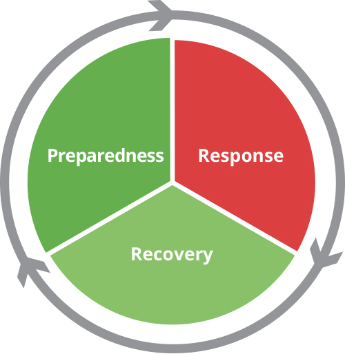
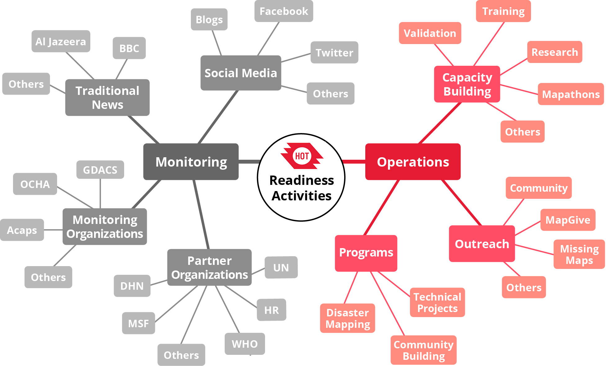

## Activation Anatomy

Before getting into the details of HOT operations, let's look at where the concept of Activation comes from and the HOT policy and guidance behind what is publicly called the HOT Disaster Mapping Program.

---

### Reading Materials

* HOT Community Code of Conduct: The HOT Code of Conduct is required of all who wish to be involved in the HOT community. Link: [https://www.hotosm.org/code-of-conduct.html](https://www.hotosm.org/code-of-conduct.html)
* HOT Activation Protocol: The Activation Protocol defines the flow of activities during a HOT Activation and describes how our trained volunteers perform the tasks that lead to a successful and efficient response. Link: [http://hotosm.org/sites/default/files/HOTActivationProtocol.pdf](http://hotosm.org/sites/default/files/HOTActivationProtocol.pdf)

---

### Disaster Cycle

In this lesson we'll introduce the Disaster Cycle and how HOT activities correspond.

#### Phases of Disaster Cycle

In this lesson we'll introduce the Disaster Cycle and how HOT activities correspond.

There are nearly as many ways to explain what HOT refers to as the "Disaster Cycle" as there are organizations involved in disaster. Many of them have a few things in common and most of the first responders you might talk to often say something like 'we are always somewhere within the disaster cycle'.

The Center for Disaster Philanthropy has a pretty good detailed description of what they call the "[Disaster Life Cycle](http://disasterphilanthropy.org/the-disaster-life-cycle/)", but basically the same concept. In this version they describe four phases: mitigation, disaster preparedness, disaster response and disaster recovery.

For HOT's purpose our activities are almost always useful for both mitigating and preparation for disaster, so we have simplified our disaster cycle to: preparedness, response and recovery.

#### Preparedness

More on this in Article 3: HOT Readiness; in general our 'day-to-day' operations including Disaster Mapping, but even more so the programs of Community Building and Technical Development as well as outreach, capacity building and disaster monitoring help prepare the organization as well as the map and mapping tools for the next response.

#### Response

The response phase begins as an event unfolds, or if it can be predicted as with a typhoon as example, first responders and aid organizations including HOT may try to get a head-start by responding before there is any impact from the event.

This is when HOT decides whether or not to activate or otherwise what sort of activities or support can be provided from the resources in the Disaster Mapping program, visit [https://www.hotosm.org/what-we-do](https://www.hotosm.org/what-we-do) for more information on all programs.   

#### Recovery

Although HOT activities may not change for quite some time after the impact of an event has passed and the affected community enters the recovery phase, typically an Activation will begin to wind-down and may be transitioned to another organization or the local OSM community to continue. HOT works throughout an Activation to support the growth of local community as is the hope with all of OSM that the data continues to be added and maintained in perpetuity.   

#### Review

Which of the following is an example of how geodata might be used during a disaster?

* Rubble removal calculations
* Population estimates
* Navigation and Routing
* Damage Assessments

People reading this material for credit on [the HOT Courses website](http://courses.hotosm.org/) should share their answer in the \#courses slack channel on HOT's Slack \( [Request Invite](http://slack.hotosm.org) \) If anyone has any question about the correct answer to a Review question, please ask in the \#courses channel of HOT's Slack.

### Activation Basics

This lesson teaches how Activation has evolved over time and the policies that guide operations.

#### A Brief History

‘Activation’ is the concept that the Humanitarian OpenStreetMap Team \(HOT\) was founded on. This relates to coordinating the multi-million strong global community of OpenStreetMap \(OSM\) contributors in response to a disaster. Although HOT has since grown to do much more, the activities carried out during all phases of the disaster cycle fall under the term “Activation” -  a common phrase used by digital humanitarians. For external communication HOT uses the term “Disaster Mapping”, for more information on the organization [take the course: HOT 101](http://courses.hotosm.org/course/view.php?id=5)

All people engaged in HOT activities need to adhere to the HOT Community [Code of Conduct](https://www.hotosm.org/code-of-conduct.html); however, Activators should also be familiar with the [HOT Membership Code](https://github.com/hotosm/hotosm-website/blob/gh-pages/downloads/HOT-Membership-Code.pdf).  

#### Activation Working Group

Activation Working GroupThe HOT Activation Working Group is tasked with establishing how we define HOT Activation and developing surrounding protocols and guidance. In 2012, the group did quite a bit of work towards formalizing what an Activation is, versus non-disaster and non-HOT-driven disaster mapping. Although nothing was officially adopted then, it created the basis for how HOT conducted activities over the next several years. Including through many difficult Activations including Typhoon Haiyan, the Ebola Epidemic, the Nepal Earthquakes and many other disaster mapping projects.

[Learn more about the Activation Working Group here](http://wiki.openstreetmap.org/wiki/Humanitarian_OSM_Team/Working_groups/Activation).

Because of the successful Activation for Ebola beginning March 2014, HOT was awarded a grant from the Hewlett Foundation to use in various ways to improve our response. The monies were divided between three separate projects; two Tech improvements: Export Tool and Field Papers, and the Activation Curriculum development.

#### Components of an Activation

During the early discussion around developing an Activation Curriculum it became apparent that there are two very distinct components of HOT Activation/the Disaster Mapping Program. There is a protocol\(i.e. process\) that is designed to be strictly followed; to both make a decision to activate and the deliverables/services that entails - and this is what the Activation Working Group has worked hard to better define over the years.

[Click here to view the Activation Protocol](https://drive.google.com/open?id=1qefHRE3_wUyG3lMSb7NlkSDtPuQeaQXsflkxt3E3xSA).

The other component, that was more lacking, is a training program to build both the number of competent Activators up, and the overall knowledge and skillset of each individual.

There are also ‘tangents’ to HOT Activation, such as enhancements to the Tasking Manager, Export Tool, LearnOSM and all the other tools including those that we will want to build in the future to better fulfill our mission.

#### Review

Match the document description with the corresponding source document. Would you find the below items in the Activation Protocol, HOT Code / Code of Conduct or the Activation Working Group Terms of Reference?

* A document that sets the flow of activities during an HOT Activation.
* This is a section of another document that governs the behavior of HOT volunteers.
* This document describes the responsibilities and methods for drafting HOT Activation related policies and guidance.

### HOT Readiness

This lesson teaches HOT readiness activities.

#### Readiness Activities

During day-to-day operations HOT is continually working to be ready, and improve its ability, to provide assistance to those in need. All Activators and those interested in volunteering for HOT Activations need to be engaged in HOT activities. This includes monitoring news and partner communication as well as normal operational activities including outreach, capacity building and HOT Programs of Disaster Mapping, Community Building and Technical Projects.  

#### HOT Programs

* [Disaster Mapping](http://hotosm.org/projects/disaster-mapping) - Which you are learning about in this course.
* [Community Building](http://hotosm.org/projects/community) - HOT sends trainers and supports locals to build OSM communities around the globe.
* [Technical Development](http://hotosm.org/projects/technical) - HOT creates and maintains several important OSM related software applications.

#### Capacity Building

During day-to-day operations, HOT is also continually working to increase our capacity to assist.  Often this is done through outreach directly by individuals in the HOT community talking and connecting with other individuals unaware of HOT. We also have partner projects such as [Missing Maps](http://missingmaps.org/) and [Map Give](http://mapgive.state.gov/) that work to bring new audiences to OpenStreetMap as well as map those places that need attention due to little or no local mapping community.

HOT also works to support, promote and research "Mapathons" \(i.e. coordinated editing by a group\), as well as develops and maintains training materials at [LearnOSM.org](http://learnosm.org/).

#### Disaster Monitoring

The single greatest resource HOT has to monitor for disasters is the global volunteer community. Individuals monitoring their various local news sources as well as social media and other online communications are typically the ones to first alert the organization that something has happened or predicted to have a humanitarian impact. Partner organizations also request HOT to assist when they are preparing or responding to an event and many of them have a branch or it is their mission to monitor disaster.

#### Review

HOT sends people into the field to map, train and build local OpenStreetMap communities in places like Mongolia, Tanzania and Haiti?

* True
* False

People reading this material for credit on [the HOT Courses website](http://courses.hotosm.org/) should share their answer in the \#courses slack channel on HOT's Slack \( [Request Invite](http://slack.hotosm.org) \) If anyone has any question about the correct answer to a Review question, please ask in the \#courses channel of HOT's Slack.

