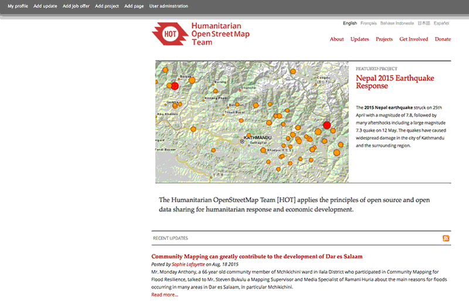

## Capture Progress
This unit covers the basic documentation and reporting HOT expects when an Activation begins and what needs to be maintained until its conclusion.

---
**Items to Read**

[LearnOSM: Editing the Wiki URL](http://learnosm.org/en/intermediate/editing-the-wiki/)
To complete this Unit you will need to be familiar with wiki editing, complete or review this LearnOSM module.

---

### OSM Wiki
Not all Activations will the same level of documentation and reporting, a wiki-page is usually the 'bare minimum' of documentation to begin an Activation.

**HOT Wikipage**

The root wiki-page for HOT lives inside the OpenStreetMap wiki and it is a good starting place for information on HOT. Take a moment to review it here:

http://wiki.openstreetmap.org/wiki/Humanitarian_OSM_Team

**Activation Wikipage**

Most if not all Activations require their own wiki-page as there is no better way for the Activation Team to both inform the community and the community contribute to keeping an up-to-date status and single repository of information. Although formatting and content changes a bit each time, the wiki-page for Typhoon Haiyan is a great example of how much and why a wiki-page can be critical to a successful response.

http://wiki.openstreetmap.org/wiki/Typhoon_Haiyan

**Activation Template**

The Activation Working Group maintains a 'very broad' and often a bit more than necessary template for Activations. It is recommended that you use this more as a 'cut and paste' resource as you need them rather than starting with the entire page - however, it can be tricky to retain the proper pieces for formatting if it is done this way. Take a moment to review and 'bookmark'/'watch' the page so you can quickly find it:

http://wiki.openstreetmap.org/wiki/Template:Activation

#### Review

Which one of the following is not a potential component of an Activation Wikipage?
* Descriptions and links for maps and data services.
* General information on HOT and OpenStreetMap.
* Links to news media print and video reports.
* The Activation Working Group meeting minutes.

**Project Page**

Not many of our minor Activations generate enough traffic to our website to warrant a project page, and sometimes due to sensitivities we may not want one, however when major disaster strikes it is essential.

**HOT Website**

Hopefully you have already explored the HOT website:
http://hotosm.org/

In particular, for Activation reporting please review the "Disaster Mapping" page:
http://hotosm.org/projects/disaster-mapping

**Activation Project Pages**

If you explore the [Ivory Coast Activation](http://hotosm.org/projects/c%C3%B4te-divoire-0) project page, you will see it contains just a brief description, but also provides a quick link for the more detailed wiki-page and a contact; maybe not essential to Activation coordination, but can catch interest and inform people who find HOT through the website. In contrast, the [West Africa Ebola](http://hotosm.org/projects/west_africa_ebola_epidemic) and [Nepal Earthquakes](http://hotosm.org/projects/nepal_2015_earthquake_response) project pages have many additional updates (blog posts) attached. In these cases, this was a huge benefit to the success of the project by keeping up momentum and recruiting additional mappers who probably would not find the wiki-page.

**Creating a Project Page**

To create a project page, you must first have at minimum the "content creator" role on the HOT website; email webmaster@hotosm.org if you do not have a profile or need additional permissions. Once you are logged-in with sufficient access, you should see something like this (note that depending on permissions you may not see all the settings). 

Once you have started a new project page, make sure to complete these settings:

* **Project Type:** set this to "Disaster mapping"
* **Timespan:** most Activations will not have a predicted end-date, uncheck the "show end date" box
* **Title:** this should match the wiki-page title
* **Language:** use appropriate language for the project page
* **Contact:** add a mailto: address, generally "mailto:activation@hotosm.org"
* **Project Page:** add the link to the wiki-page
* **Body:** a brief  description of the Activation written for public, contact the communications working group for assistance if needed.
* **Project Image:** if no good imagery is available, ask the Usability role to make a map. 

**Creating an Update**

Very similar to creating the project page, just click "Add update" instead. Make the settings:

* **Title:** try to make it short but informative
* **Language:** use appropriate language for post, shorter posts might contain multiple languages, in that case use the language of the project page
* **Related Project:** pick the corresponding project from the drop down
* **Working Group:** choose "Activation"
* **Update Tags:** optionally add tags for the region or other common subjects
* **Body:** write the article for a public audience, avoid acronyms and technical or insider language; ask the communication working group for assistance if desired.
* **Images:** it is highly encouraged to add an image to every post
* **Documents:** additionally you can attach documents to a post

#### Review

If the settings are correct on a website update, the post will automatically be attached to the Activation's project page?
* True
* False
